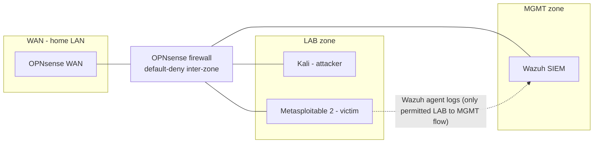

# homelab-soc
This is a segmented detection-engineering lab built on a single Proxmox host. Attack activity occurs in one zone and the resulting telemetry is shipped to a SIEM in another. All traffic between zones is routed and filtered by a dedicated OPNsense firewall VM. This repository contains the key details, design choices and steps for completing this project.

**Goal:** To apply my cybersecurity knowledge and to specifically develop my blue-team skills (log pipeline engineering, firewall policy design, and detection writing) against attack traffic I generate.

## Architecture Overview



Three zones on one hypervisor, all inter-zone traffic routed and filtered by a dedicated OPNsense VM:


- **MGMT** — the trusted zone. Hosts the Wazuh SIEM.
- **LAB** — the untrusted zone. Attacker (Kali) and victim (Metasploitable 2).
- **WAN** — uplink to the home LAN.

Between the MGMT and the LAB zones, the only permitted traffic is the telemetry logs from the victims Wazuh agent being sent to the Wazuh SIEM (LAB → MGMT). Everything else crossing a zone boundary is denied. Full topology, addressing, data flows, trust boundaries, and threat model are documented in docs/01-architecture.md.

## Stack
 
| Component | Role |
|---|---|
| OPNsense | Firewall / router between zones |
| Wazuh | SIEM — log collection, rules, MITRE ATT&CK mapping |
| Kali Linux | Attacker |
| Metasploitable 2 | Victim, runs the Wazuh agent |

## Status
 
- [x] Phase 1 design — architecture, addressing, firewall policy, ADRs
- [ ] Phase 1 build — bridges, OPNsense, Wazuh, agents, end-to-end log pipeline
- [ ] Phase 1 exercises — generate attack telemetry from Kali, detect it in Wazuh
## Limitations
- **Single physical NIC** — zone segmentation is software-only (Linux bridges). A hypervisor compromise collapses every boundary.
- **Proxmox web UI on the WAN bridge** — reachable for everyone on the home LAN. Security here will be improved later.

Full limitation details in the [architecture doc](docs/01-architecture.md)

## Repository Layout
```
homelab-soc/
├── docs/        # architecture, design decisions (ADRs), build docs
├── configs/     # sanitised configs: OPNsense, Wazuh rules/decoders, Proxmox networking
├── exercises/   # attack scenarios and the detections written for them
└── diagrams/    # Mermaid sources
```
 
## Disclaimer
 
Attacks conducted in this project target machines I own, on an isolated network.
 


